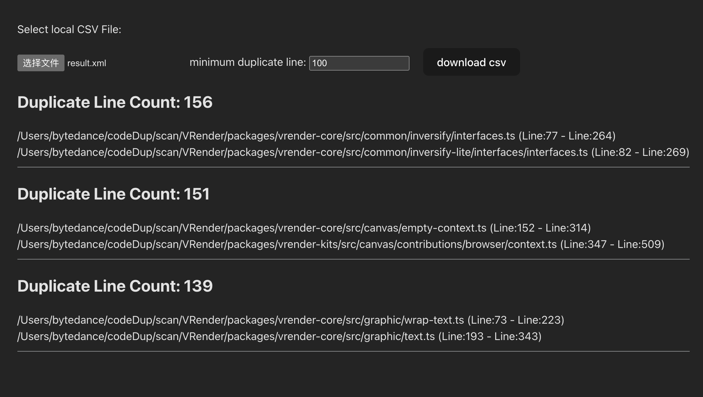

# Simian XML Visualization

[Simian](https://simian.quandarypeak.com/) can analyze any human readable file, vintage and modern.
It’s like having another pair of eyes to improve the quality of software.

Simian will display the results in xml format, which is still not easy to read.

This tiny typescript project can be used to convert the xml files output by simian into more readable html pages, and provide the function of downloading csv files.

## 📦 How to Use

1. Start the project

```bash
$ yarn
$ yarn dev
```

2. Open the local page
3. Select a simian xml output file, like:

```xml
Simian Similarity Analyzer 4.0.0 - https://simian.quandarypeak.com
Copyright (c) 2023 Quandary Peak Research. All rights reserved.
Subject to the Quandary Peak Academic Software License.
<?xml version="1.0" encoding="UTF-8"?>
<?xml-stylesheet href="simian.xsl" type="text/xsl"?>
<simian version="4.0.0">
    <check failOnDuplication="true" ignoreCharacterCase="true" ignoreCurlyBraces="true" ignoreIdentifierCase="true" ignoreModifiers="true" ignoreStringCase="true" threshold="3">
        <set lineCount="3" fingerprint="29aa6de95d9144b0e40bef634211fdf4">
        ...More
```



## 🔗 Related Links

- [Simian Documentation](https://simian.quandarypeak.com/docs/)
